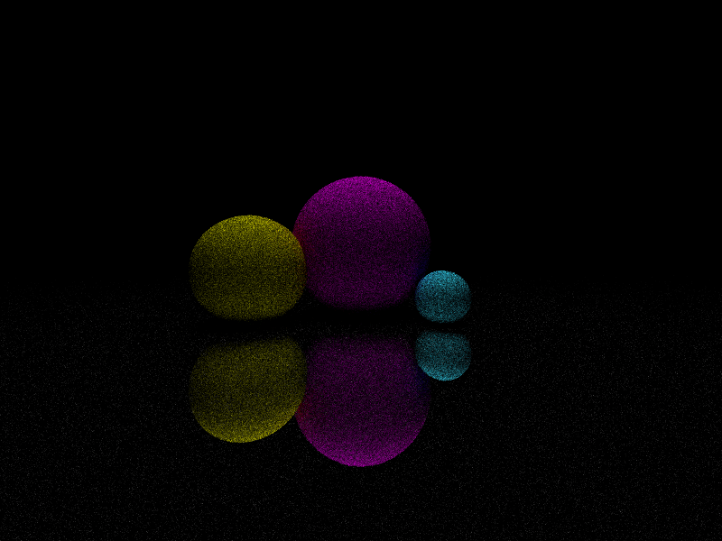
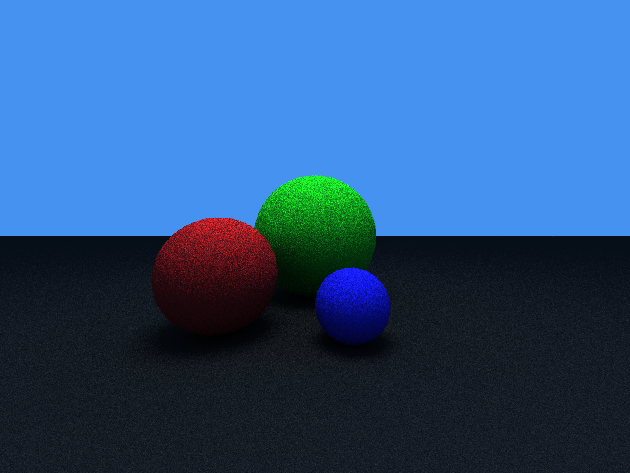
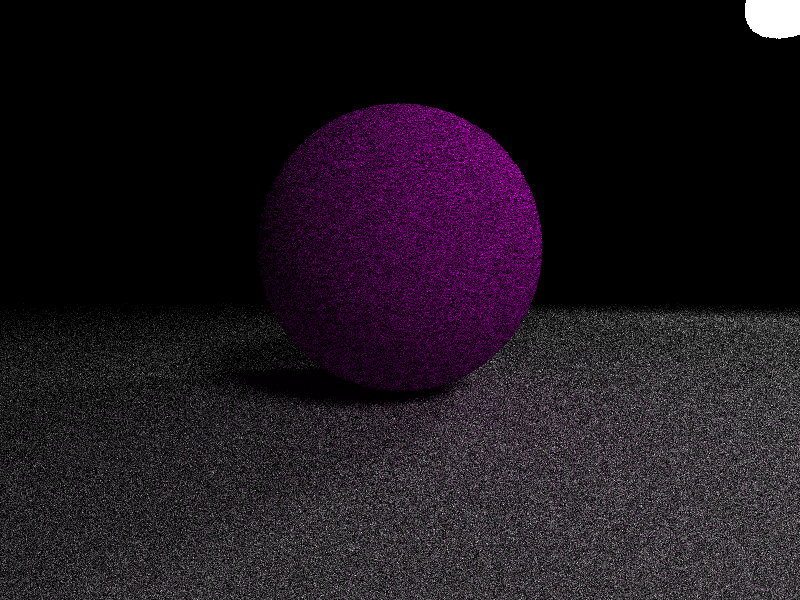
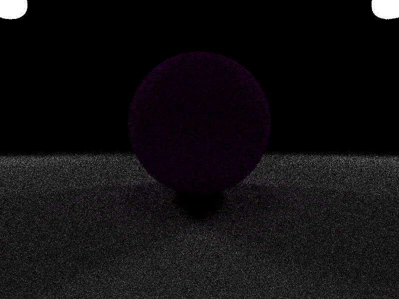

# Path Tracing

> A basic python implementation of a path tracer - "Path tracing is a computer graphics Monte Carlo method of rendering images of three-dimensional scenes such that the global illumination is faithful to reality." - [Wikipedia](https://en.wikipedia.org/wiki/Path_tracing)

---

### Motivation 

Inspired by Matt Godbolt's [presentation](https://youtu.be/HG6c4Kwbv4I) at CppCon 2019, i chose this project as a way to further immerse and improve my Python programming skills. 

---

### Path traced images

Here are some rendered images i rendered demonstrating the current capabilities of this Path Tracer such as shadow effects from multiple light sources and reflectance:

[Back To The Top](#Path-Tracing)

---

## License

MIT License

Copyright (c) [2017] [James Q Quick]

Permission is hereby granted, free of charge, to any person obtaining a copy
of this software and associated documentation files (the "Software"), to deal
in the Software without restriction, including without limitation the rights
to use, copy, modify, merge, publish, distribute, sublicense, and/or sell
copies of the Software, and to permit persons to whom the Software is
furnished to do so, subject to the following conditions:

The above copyright notice and this permission notice shall be included in all
copies or substantial portions of the Software.

THE SOFTWARE IS PROVIDED "AS IS", WITHOUT WARRANTY OF ANY KIND, EXPRESS OR
IMPLIED, INCLUDING BUT NOT LIMITED TO THE WARRANTIES OF MERCHANTABILITY,
FITNESS FOR A PARTICULAR PURPOSE AND NONINFRINGEMENT. IN NO EVENT SHALL THE
AUTHORS OR COPYRIGHT HOLDERS BE LIABLE FOR ANY CLAIM, DAMAGES OR OTHER
LIABILITY, WHETHER IN AN ACTION OF CONTRACT, TORT OR OTHERWISE, ARISING FROM,
OUT OF OR IN CONNECTION WITH THE SOFTWARE OR THE USE OR OTHER DEALINGS IN THE
SOFTWARE.

[Back To The Top](#Path-Tracing)
